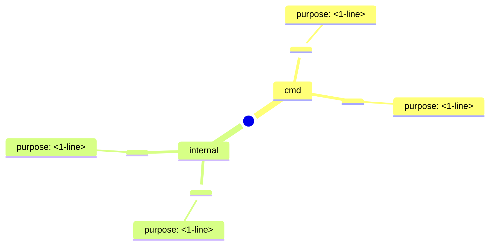
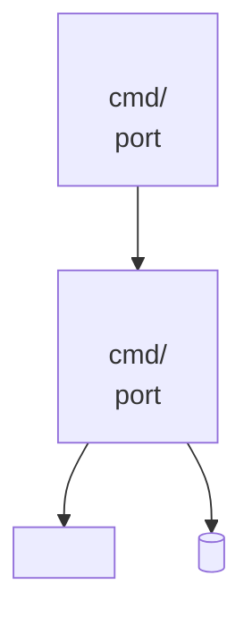
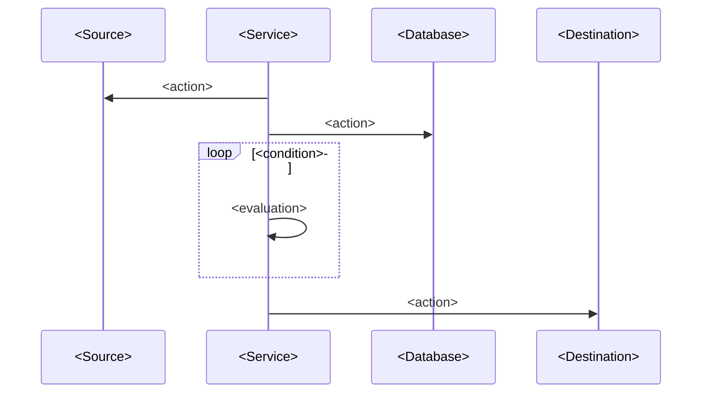

# Map Project

Generate two markdown artifacts that capture the project's architecture and symbol surface:

- `spec/project-map.md` — package/service/interface level with Mermaid diagrams (5 dimensions)
- `spec/symbol-map.md` — exported Go symbols for `internal/` packages

Both artifacts are designed for LLM consumption (accurate, complete, structured) and developer reading (concise, well-organized, diagrammed).

## Artifact structure

### Shared header

Every artifact starts with:

```markdown
# Project Map — <project-name>
> Generated: YYYY-MM-DD by `sp.map-project`
> Source: commit <hash>
```

And ends with:

```markdown
---
_Regenerate with `sp.map-project` when the codebase changes._
```

## Methodology — 5 dimensions

### 1. Package/module map

**Goal**: Hierarchical tree of every package with a 1-line purpose.

**Exploration**:
- Walk `cmd/` — each subdirectory is a service binary. Read `main.go` (first 40 lines) to learn the service role.
- Walk `internal/` — each subdirectory is a shared package. Read `*.go` files to identify the package's core type or responsibility.
- For each package, write a 1-line "what it does" and a 1-line "key types/interfaces it exposes".

**Mermaid template** — `mindmap`:



**Section format**:

```markdown
## Package/Module Map

<mindmap diagram>

### cmd/<service1>
Purpose: <1-line>
Entry: `main.go`

### internal/<package1>
Purpose: <1-line>
Key types: <Type1>, <Type2>, <Interface1>
```

### 2. Dependency graph

**Goal**: Directed graph of import relationships between project packages.

**Exploration**:
- For each package, read import statements or use `go list -f '{{.Imports}}' <package>`.
- Filter to project-internal imports only (exclude stdlib and third-party).
- Group nodes by layer:
  - **Services** — `cmd/*`
  - **Data** — `internal/db`, `internal/symbol`
  - **Execution** — `internal/trading`, `internal/backtest`, `internal/bars`
  - **Abstraction** — `internal/exchange`, `internal/lua`
  - **Config/UI** — `internal/config`, `internal/web`, `internal/ctrl`

**Mermaid template** — `flowchart LR` with subgraphs:

```mermaid
flowchart LR
  subgraph Services
    <svc1>
    <svc2>
  end
  subgraph Data
    <pkg1>
    <pkg2>
  end
  <svc1> --> <pkg1>
  <svc1> --> <pkg2>
```

**Section format**:

```markdown
## Dependency Graph

<flowchart diagram>

### Layer key
- **Services**: directly executable binaries
- **Data**: persistence and domain models
- **Execution**: business logic evaluation
- **Abstraction**: external system boundaries
- **Config/UI**: shared infrastructure and web layer
```

### 3. Service overview

**Goal**: High-level view of each binary, what it does, how it communicates.

**Exploration**:
- Read each `cmd/<name>/main.go` fully, not just the first 40 lines.
- Identify: port, mode selection, key dependencies injected at startup.
- Check docker-compose or config for port numbers.

**Mermaid template** — `flowchart TB`:



**Section format**:

```markdown
## Service Overview

<flowchart diagram>

| Service | Binary | Port | Role |
|---------|--------|------|------|
| <name> | `cmd/<name>` | <N> | <role> |
```

### 4. Data flow

**Goal**: Timeline or sequence showing how data moves through the system.

**Exploration**:
- For each data flow path (bar data ingestion, trade execution, backtest), trace: source → transform → sink.
- Identify trigger events (timer, HTTP request, strategy signal).
- Note which mode (live/paper/backtest) applies to each path.

**Mermaid template** — `sequenceDiagram`:



**Section format**:

```markdown
## Data Flow

### Path 1: Bar data ingestion
<sequence diagram>

### Path 2: Trade execution
<sequence diagram>

### Path 3: Backtest evaluation
<sequence diagram>
```

### 5. Key interfaces & deep modules

**Goal**: Interface definitions and their concrete implementations.

**Exploration**:
- Read each `internal/<package>/` for interface definitions.
- Identify all types that satisfy each interface (including mock types in `mock.go` files).
- Document key methods and their signatures.

**Mermaid template** — `classDiagram`:

```mermaid
classDiagram
  class <InterfaceName> {
    <<interface>>
    +Method1(arg Type) ReturnType
    +Method2(arg Type) ReturnType
  }
  class <ConcreteImpl> {
    +Method1(arg Type) ReturnType
    +Method2(arg Type) ReturnType
  }
  <InterfaceName> <|-- <ConcreteImpl>
  <InterfaceName> <|-- <MockImpl>
```

**Section format**:

```markdown
## Key Interfaces

### `internal/<package>.<InterfaceName>`

```go
type InterfaceName interface {
    Method1(ctx context.Context, arg Type) ReturnType
    Method2(ctx context.Context, arg Type) ReturnType
}
```

**Implementations**:
| Type | Package | Notes |
|------|---------|-------|
| `ConcreteImpl` | `internal/<package>` | Production implementation |
| `MockImpl` | `internal/<package>` | Test mock |

<if applicable, classDiagram here>
```

---

## Symbol Map — `spec/symbol-map.md`

**Scope**: `internal/` packages only. `cmd/` packages are thin mains and covered by the project map.

**Per-package format**:

```markdown
## internal/<package>

Purpose: <1-line>

### Types

#### `TypeName`
Fields: <list if struct>
Methods:
- `MethodName(args) ReturnType` — <1-line>

#### `InterfaceName`
Methods:
- `MethodName(args) ReturnType` — <1-line>

### Functions

#### `FunctionName(args) ReturnType`
<1-line description>

### Constants

#### `ConstName` = <value>
<1-line description>
```

**Order**: package by package in directory order (alphabetical). Within a package: Types before Functions before Constants. Within Types: exported structs first, then interfaces.

Only document exported symbols (capitalized). Skip unexported helpers — they are implementation detail.

---

## Quality checklist

Before writing either artifact, verify:

- [ ] Every `internal/` and `cmd/` package is covered
- [ ] Mermaid syntax is valid (no missing quotes, brackets balanced, directions correct)
- [ ] Arrow directions in flowcharts are accurate (caller → callee, producer → consumer)
- [ ] Interface methods match the actual Go signatures
- [ ] Service ports match `internal/config` or `docker-compose.yml`
- [ ] Data flow arrows show the correct direction (write → DB, read ← DB)
- [ ] All names use the project's canonical terms from `spec/glossary.md`
